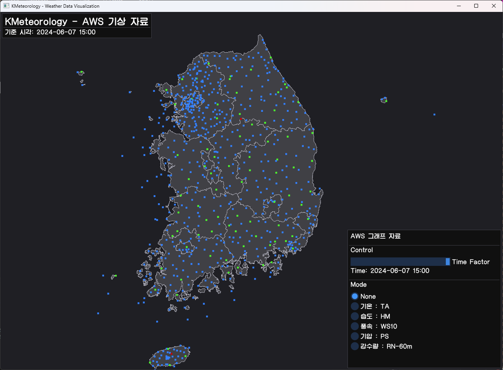
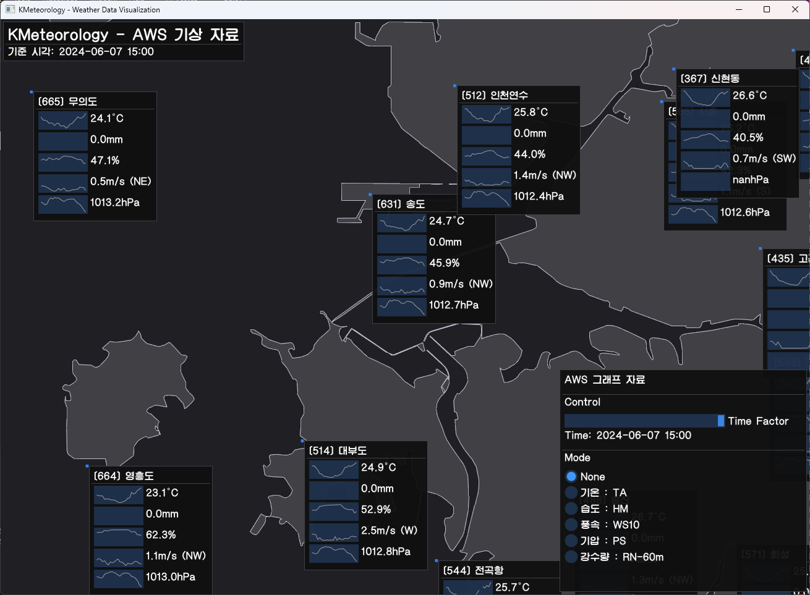
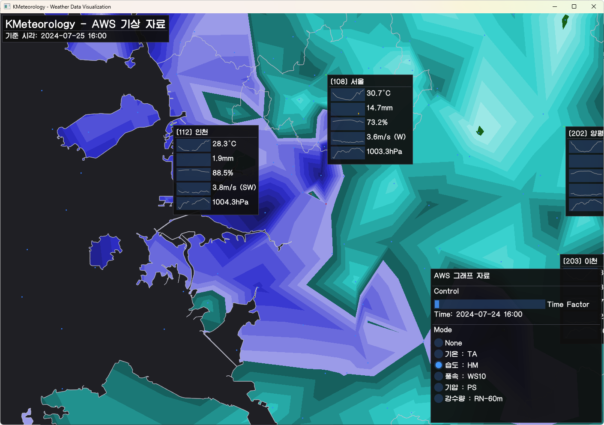
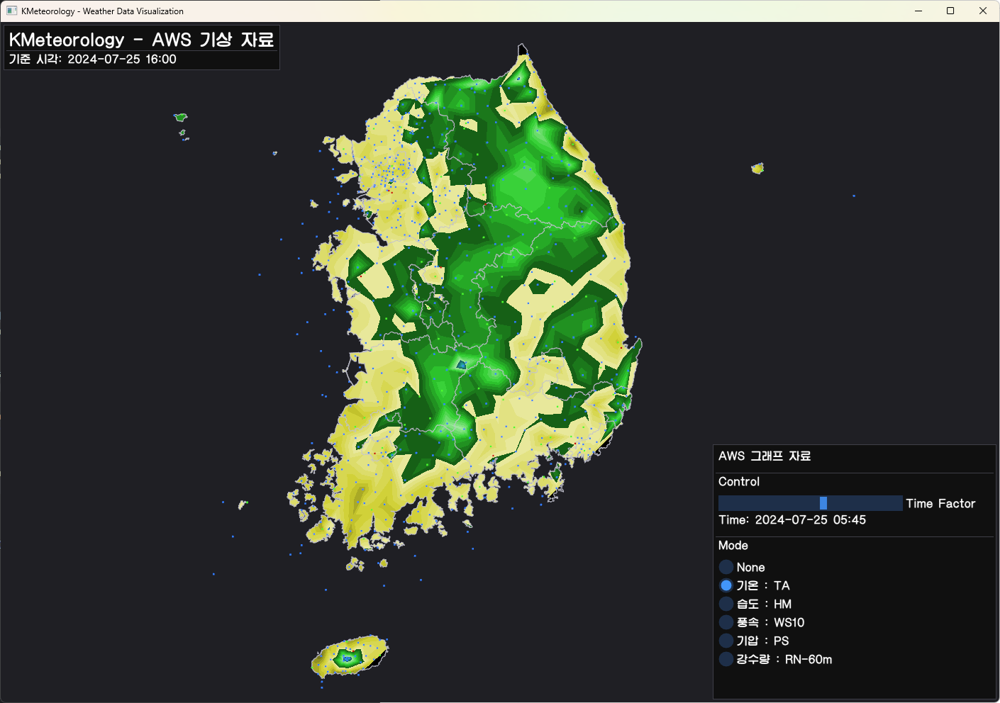

# KMeteorology

KMeteorology is a Python project that aims to visualize meteorological data supplied by the Korea Meteorological Administration (KMA).

## Features

- Visualization of various meteorological data points

## Screenshots

